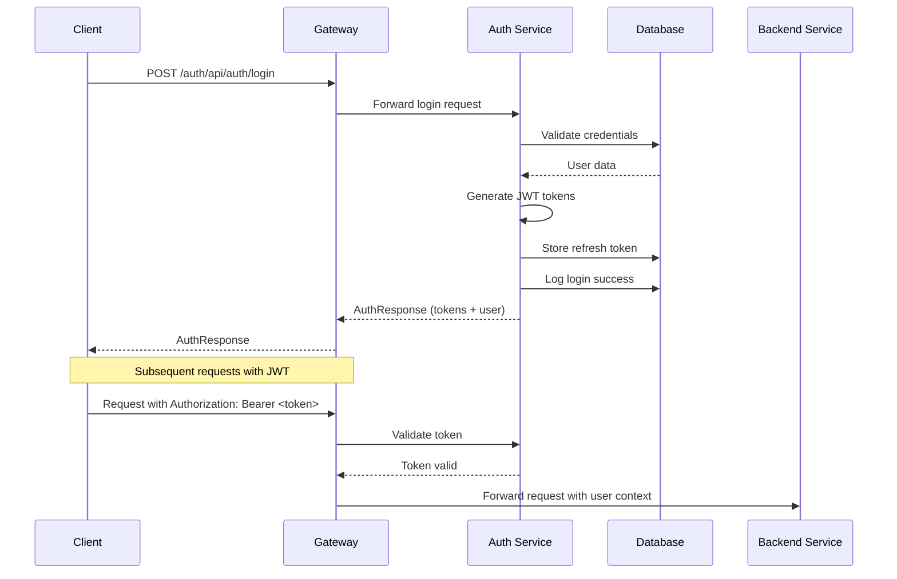

# Auth Service - AGENTS Documentation

## Overview

The **Auth Service** is responsible for user authentication and authorization in the COMPTA ERP system. It handles user registration, login, JWT token management, role-based access control, and authentication logging.

**Service Name:** auth-service  
**Port:** 8081  
**Context Path:** `/auth`  
**Database Schema:** `auth`

---

## Purpose and Responsibilities

The Auth Service provides the following core functionality:

- **User Authentication**: Login with username/password, JWT token generation and validation
- **User Management**: Create, update, deactivate users, manage user profiles
- **Role-Based Authorization**: Assign and manage user roles (ADMIN, COMPTABLE, SOCIETE, EMPLOYEE)
- **Token Management**: JWT access tokens and refresh tokens with expiration handling
- **Authentication Logging**: Track login attempts, failures, and security events
- **Password Management**: Password hashing, validation, and change functionality
- **Account Security**: Failed login tracking, account locking, and unlocking

---

## Technologies and Frameworks

### Core Framework
- **Spring Boot 3.x** - Application framework
- **Spring Security** - Security and authentication framework
- **Java 21** - Programming language

### Authentication & Authorization
- **JWT (JSON Web Tokens)** - Stateless authentication
  - `jjwt-api` - JWT API
  - `jjwt-impl` - JWT implementation
  - `jjwt-jackson` - Jackson integration

### Database & ORM
- **PostgreSQL** - Primary database
- **Flyway** - Database migration management
- **jOOQ** - Type-safe SQL query builder (code generation enabled)

### Build Tools
- **Maven** - Build and dependency management

### Documentation
- **SpringDoc OpenAPI** - API documentation (Swagger UI)

### Monitoring & Observability
- **Sentry** - Error tracking and performance monitoring
- **Spring Boot Actuator** - Health checks and metrics (via compta-commons)

### Testing
- **Spring Boot Test** - Testing framework
- **Testcontainers** - Integration testing with PostgreSQL
- **JUnit 5** - Unit testing

### Development
- **Lombok** - Reduce boilerplate code

---

## API Endpoints

### Authentication Endpoints

| Method | Path | Description | Authentication |
|--------|------|-------------|----------------|
| POST | `/auth/api/auth/login` | User login, returns JWT tokens | None |
| POST | `/auth/api/auth/refresh` | Refresh access token using refresh token | None |
| POST | `/auth/api/auth/logout` | Logout user, invalidate refresh token | Required |
| GET | `/auth/api/auth/me` | Get current user profile | Required |
| PUT | `/auth/api/auth/me` | Update current user profile | Required |
| PUT | `/auth/api/auth/password` | Change current user password | Required |

### User Management Endpoints

| Method | Path | Description | Authentication | Role Required |
|--------|------|-------------|----------------|---------------|
| GET | `/auth/api/users` | List all users | Required | ADMIN, COMPTABLE |
| GET | `/auth/api/users/{id}` | Get user by ID | Required | ADMIN, COMPTABLE |
| PUT | `/auth/api/users/{id}` | Update user | Required | ADMIN |
| DELETE | `/auth/api/users/{id}` | Delete user | Required | ADMIN |
| PUT | `/auth/api/users/{id}/activate` | Activate user account | Required | ADMIN |
| PUT | `/auth/api/users/{id}/deactivate` | Deactivate user account | Required | ADMIN |
| PUT | `/auth/api/users/{id}/unlock` | Unlock user account | Required | ADMIN |
| GET | `/auth/api/users/{id}/roles` | Get user roles | Required | ADMIN, COMPTABLE |
| POST | `/auth/api/users/{id}/roles` | Assign role to user | Required | ADMIN |
| DELETE | `/auth/api/users/{id}/roles/{roleId}` | Remove role from user | Required | ADMIN |

### User Creation Endpoints

| Method | Path | Description | Authentication | Role Required |
|--------|------|-------------|----------------|---------------|
| POST | `/auth/api/users/comptable` | Create comptable user | Required | ADMIN |
| POST | `/auth/api/users/societe` | Create societe user | Required | ADMIN, COMPTABLE |
| POST | `/auth/api/users/employee` | Create employee user | Required | ADMIN, COMPTABLE, SOCIETE |

### Authentication Log Endpoints

| Method | Path | Description | Authentication | Role Required |
|--------|------|-------------|----------------|---------------|
| GET | `/auth/api/auth-logs` | Get authentication logs | Required | ADMIN |

---

## Dependencies on Other Services

### External Dependencies
- **PostgreSQL Database** - Stores user and authentication data in the `auth` schema

### Internal Dependencies
- **compta-commons** - Shared utilities, security, and common configurations

### No Service-to-Service Dependencies
The Auth Service is self-contained and does not depend on other microservices. Other services depend on it for authentication.

---

## Configuration Details

### Application Configuration (`application.yml`)

```yaml
spring:
  application:
    name: auth-service
  datasource:
    url: jdbc:postgresql://localhost:5432/compta
    username: postgres
    password: password
    driver-class-name: org.postgresql.Driver
  flyway:
    enabled: true
    schemas: auth
    default-schema: auth

server:
  port: 8081
  forward-headers-strategy: framework
  servlet:
    context-path: /auth

jwt:
  secret: ${JWT_SECRET:404E635266556A586E3272357538782F413F4428472B4B6250645367566B5970}
  expiration: ${JWT_EXPIRATION:86400000}        # 24 hours
  refresh-expiration: ${JWT_REFRESH_EXPIRATION:604800000}  # 7 days
  issuer: compta-auth-service
  header: Authorization
  prefix: 'Bearer '

sentry:
  dsn: ${SENTRY_DSN:}
  environment: ${SENTRY_ENVIRONMENT:development}
  traces-sample-rate: 0.1
  debug: false
  send-default-pii: false
  tags:
    service: auth-service
    module: authentication

springdoc:
  api-docs:
    path: /v3/api-docs
  swagger-ui:
    path: /swagger-ui.html
    operations-sorter: method
    persist-authorization: true
    config-url: /v3/api-docs/swagger-config
    url: /v3/api-docs
  override-with-generic-response: false
```

### Environment Variables

| Variable | Description | Default |
|----------|-------------|---------|
| `JWT_SECRET` | Secret key for JWT signing (64+ chars recommended for production) | `404E635266556A586E3272357538782F413F4428472B4B6250645367566B5970` |
| `JWT_EXPIRATION` | Access token expiration in milliseconds | `86400000` (24 hours) |
| `JWT_REFRESH_EXPIRATION` | Refresh token expiration in milliseconds | `604800000` (7 days) |
| `SENTRY_DSN` | Sentry DSN for error tracking | (empty) |
| `SENTRY_ENVIRONMENT` | Sentry environment name | `development` |

---

## Database Schema

### Schema: `auth`

#### Tables

##### `users`
Core user authentication and profile information.

| Column | Type | Description |
|--------|------|-------------|
| `id` | BIGSERIAL | Primary key |
| `username` | VARCHAR(100) | Unique username (NOT NULL) |
| `email` | VARCHAR(255) | Unique email (NOT NULL) |
| `password` | VARCHAR(255) | BCrypt hashed password (NOT NULL) |
| `first_name` | VARCHAR(100) | User's first name |
| `last_name` | VARCHAR(100) | User's last name |
| `phone` | VARCHAR(20) | Contact phone number |
| `is_active` | BOOLEAN | Account active status |
| `is_locked` | BOOLEAN | Account locked status |
| `failed_login_attempts` | INT | Number of failed login attempts |
| `last_login_at` | TIMESTAMP | Last successful login timestamp |
| `password_changed_at` | TIMESTAMP | Last password change timestamp |
| `created_at` | TIMESTAMP | Account creation timestamp |
| `updated_at` | TIMESTAMP | Last update timestamp |
| `created_by` | BIGINT | User who created this account |
| `updated_by` | BIGINT | User who last updated this account |

**Indexes:**
- `idx_users_email` on `email`
- `idx_users_username` on `username`
- `idx_users_is_active` on `is_active`

##### `roles`
Available user roles in the system.

| Column | Type | Description |
|--------|------|-------------|
| `id` | BIGSERIAL | Primary key |
| `name` | VARCHAR(50) | Unique role name (NOT NULL) |
| `description` | VARCHAR(255) | Role description |
| `created_at` | TIMESTAMP | Creation timestamp |

**Default Roles:**
- `ADMIN` - System administrator with all rights
- `COMPTABLE` - Accountant who can manage multiple companies
- `SOCIETE` - Company user who can have multiple companies
- `EMPLOYEE` - Employee belonging to a company

##### `user_roles`
Many-to-many relationship between users and roles.

| Column | Type | Description |
|--------|------|-------------|
| `id` | BIGSERIAL | Primary key |
| `user_id` | BIGINT | Foreign key to users (NOT NULL) |
| `role_id` | BIGINT | Foreign key to roles (NOT NULL) |
| `created_at` | TIMESTAMP | Assignment timestamp |

**Constraints:**
- UNIQUE on `(user_id, role_id)`
- Foreign key to `users(id)` with CASCADE DELETE
- Foreign key to `roles(id)` with CASCADE DELETE

**Indexes:**
- `idx_user_roles_user_id` on `user_id`
- `idx_user_roles_role_id` on `role_id`

##### `refresh_tokens`
JWT refresh tokens for token renewal.

| Column | Type | Description |
|--------|------|-------------|
| `id` | BIGSERIAL | Primary key |
| `user_id` | BIGINT | Foreign key to users (NOT NULL) |
| `token` | VARCHAR(500) | Unique refresh token (NOT NULL) |
| `expires_at` | TIMESTAMP | Token expiration timestamp (NOT NULL) |
| `created_at` | TIMESTAMP | Token creation timestamp |
| `ip_address` | VARCHAR(45) | IP address when token was issued |
| `user_agent` | VARCHAR(255) | User agent string |

**Constraints:**
- UNIQUE on `token`
- Foreign key to `users(id)` with CASCADE DELETE

**Indexes:**
- `idx_refresh_tokens_token` on `token`
- `idx_refresh_tokens_user_id` on `user_id`

##### `auth_logs`
Authentication and security event logging.

| Column | Type | Description |
|--------|------|-------------|
| `id` | BIGSERIAL | Primary key |
| `user_id` | BIGINT | Foreign key to users (nullable) |
| `username` | VARCHAR(100) | Username for the event |
| `action` | VARCHAR(50) | Event type (NOT NULL) |
| `ip_address` | VARCHAR(45) | Client IP address |
| `user_agent` | VARCHAR(255) | Client user agent |
| `details` | TEXT | Additional event details |
| `created_at` | TIMESTAMP | Event timestamp |

**Action Types:**
- `LOGIN_SUCCESS` - Successful login
- `LOGIN_FAILED` - Failed login attempt
- `LOGOUT` - User logout
- `PASSWORD_RESET` - Password reset request

**Constraints:**
- Foreign key to `users(id)` with SET NULL

**Indexes:**
- `idx_auth_logs_user_id` on `user_id`
- `idx_auth_logs_created_at` on `created_at`

---

## Key Classes and Responsibilities

### Main Application Class
- **`AuthServiceApplication`** - Spring Boot application entry point

### Configuration Classes

#### `config/`
- **`SecurityConfig`** - Spring Security configuration, JWT filter setup
- **`JwtProperties`** - JWT configuration properties binding
- **`OpenApiConfig`** - Swagger/OpenAPI documentation configuration

### Controllers

#### `controller/`
- **`AuthController`** - Authentication endpoints (login, refresh, logout, profile)
- **`UserController`** - User CRUD operations and role management
- **`UserManagementController`** - User creation by role type
- **`AuthLogController`** - Authentication log retrieval

### DTOs

#### `dto/`
- **`LoginRequest`** - Login credentials (username, password)
- **`AuthResponse`** - Authentication response (access token, refresh token, user info)
- **`CreateUserRequest`** - User creation data
- **`UpdateUserRequest`** - User profile update data
- **`ChangePasswordRequest`** - Password change data (current, new, confirm)
- **`AssignRoleRequest`** - Role assignment data
- **`UserResponse`** - User profile response
- **`AuthLogResponse`** - Authentication log response

### Enums

#### `enums/`
- **`Role`** - User role enumeration (ADMIN, COMPTABLE, SOCIETE, EMPLOYEE)

### Services

#### `service/`
- **`AuthService`** - Core authentication logic (login, refresh, logout)
- **`UserManagementService`** - User CRUD and role management
- **`AuthLogService`** - Authentication logging
- **`SecurityService`** - Security-related utilities

### Security

#### `security/`
- **`JwtAuthenticationFilter`** - JWT token validation filter
- **`CustomUserDetailsService`** - User details loading for Spring Security
- **`CustomUserDetails`** - Custom user details implementation
- **`JwtAuthenticationEntryPoint`** - Authentication error handling

### Utilities

#### `util/`
- **`JwtTokenUtil`** - JWT token generation and validation utilities

### Repositories (jOOQ-generated)

#### `repository/`
- **`UserRepository`** - User data access operations
- **`RoleRepository`** - Role data access operations
- **`UserRoleRepository`** - User-role relationship operations
- **`RefreshTokenRepository`** - Refresh token operations
- **`AuthLogRepository`** - Authentication log operations

---

## Authentication Flow



---

## Development Notes

### Running the Service

```bash
# Build the service
mvn clean install

# Run the service
mvn spring-boot:run

# Or run with specific profile
mvn spring-boot:run -Dspring-boot.run.profiles=dev
```

### Accessing API Documentation

Swagger UI is available at:
- Development: `http://localhost:8081/auth/swagger-ui.html`
- API Docs: `http://localhost:8081/auth/v3/api-docs`

### Database Migration

Flyway migrations are located in `src/main/resources/db/migration/`

To add a new migration:
1. Create a new SQL file with version prefix (e.g., `V2__add_feature.sql`)
2. Flyway will automatically apply it on startup

### jOOQ Code Generation

The service uses jOOQ for type-safe SQL queries. Code is generated from the database schema:

```xml
<properties>
  <jooq.generator.db.schema>auth</jooq.generator.db.schema>
  <jooq.generator.target.package>tn.cyberious.compta.auth.generated</jooq.generator.target.package>
</properties>
```

Generated classes are placed in `src/generated/jooq/`

### Testing

Integration tests use Testcontainers with PostgreSQL:

```bash
# Run tests
mvn test
```

---

## Security Implementation

### JWT Token Structure

**Access Token:**
- Issuer: `compta-auth-service`
- Subject: User ID
- Claims: username, email, roles, first_name, last_name
- Expiration: 24 hours (configurable)

**Refresh Token:**
- Stored in database
- Linked to user and IP address
- Expiration: 7 days (configurable)
- Revoked on logout

### Password Security

- BCrypt hashing with salt
- Minimum password requirements enforced
- Password change tracking
- Failed login attempt tracking

### Account Security Features

- Account locking after multiple failed attempts
- Active/Inactive status management
- IP address tracking for authentication events
- User agent tracking for security auditing

---

## Monitoring

### Sentry Integration
- Error tracking enabled
- Distributed tracing with 10% sampling
- Service tags: `service=auth-service`, `module=authentication`

### Health Checks
Available via Spring Boot Actuator (configured in compta-commons)

### Authentication Logging
All authentication events are logged to the `auth_logs` table for:
- Security auditing
- Fraud detection
- User activity analysis

---

## Default Users

### Admin Account
- **Username:** `admin`
- **Email:** `admin@compta.tn`
- **Password:** `Admin@123`
- **Role:** `ADMIN`

> **Important:** Change the default admin password in production!

---

## Migration to OAuth2

The Auth Service is currently JWT-based and needs to be migrated to OAuth2. Key changes required:

1. Replace JWT generation with OAuth2 authorization server
2. Implement OAuth2 endpoints (authorize, token)
3. Support OAuth2 flows (Authorization Code, Client Credentials)
4. Maintain backward compatibility during transition

See project documentation for OAuth2 migration plan.

---

## Future Enhancements

- Implement OAuth2 authorization server
- Add multi-factor authentication (MFA)
- Implement password reset via email
- Add social login providers (Google, Microsoft)
- Implement session management
- Add rate limiting for authentication endpoints
- Implement account recovery flows
- Add audit trail for all user management operations
