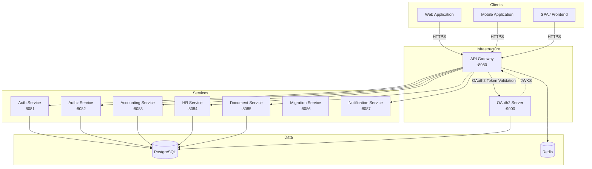
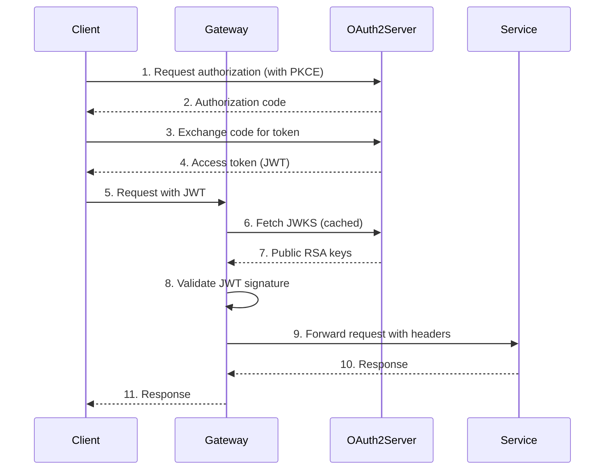

# COMPTA ERP - API Gateway & Microservices

A comprehensive ERP system built with Spring Boot microservices architecture, featuring OAuth2 authentication, API gateway, and modular service design.

## Overview

This project implements a multi-module Maven architecture with following services:

| Service | Port | Description |
|---------|------|-------------|
| **gateway** | 8080 | API Gateway with OAuth2 token validation |
| **oauth2-server** | 9000 | OAuth2 Authorization Server with PKCE support |
| **auth-service** | 8081 | User authentication and management |
| **authz-service** | 8082 | Authorization and permissions management |
| **accounting-service** | 8083 | Accounting and financial operations |
| **hr-service** | 8084 | Human resources management |
| **document-service** | 8085 | Document storage and management |
| **migration-service** | 8086 | Database migration utilities |
| **notification-service** | 8087 | Notification and messaging services |

## Architecture



## Technology Stack

### Core Framework
- **Spring Boot 3.5.9** - Application framework
- **Spring Security 6** - Security framework
- **Spring Cloud Gateway** - API Gateway
- **Spring Authorization Server 1.3+** - OAuth2 Authorization Server
- **Java 21** - Programming language

### Database & ORM
- **PostgreSQL** - Primary database
- **JOOQ** - Type-safe SQL query builder
- **Flyway** - Database migration tool

### Security
- **OAuth2** - Authorization framework
- **PKCE** - Proof Key for Code Exchange
- **JWT** - JSON Web Tokens with RSA 2048-bit signing
- **JWKS** - JSON Web Key Set for public key distribution

### Resilience & Performance
- **Resilience4j** - Circuit breaker and retry
- **Redis** - Rate limiting and caching
- **OpenTelemetry** - Distributed tracing

### Documentation
- **SpringDoc OpenAPI** - API documentation
- **Swagger UI** - Interactive API docs

## Getting Started

### Prerequisites

- Java 21+
- Maven 3.8+
- PostgreSQL 14+
- Redis 6+ (for rate limiting)

### Installation

```bash
# Clone repository
git clone <repository-url>
cd api

# Build project
mvn clean install

# Run all services (requires PostgreSQL and Redis)
mvn spring-boot:run -pl gateway
mvn spring-boot:run -pl oauth2-server
mvn spring-boot:run -pl auth-service
# ... etc for other services
```

### Database Setup

```bash
# Create database
createdb compta

# Flyway migrations are automatically applied on startup
# Each service manages its own schema
```

### Environment Variables

Create a `.env` file or set environment variables:

```bash
# Database
POSTGRES_HOST=localhost
POSTGRES_PORT=5432
POSTGRES_DB=compta
POSTGRES_USER=postgres
POSTGRES_PASSWORD=postgres

# Redis
REDIS_HOST=localhost
REDIS_PORT=6379

# OAuth2
OAUTH2_ISSUER=http://localhost:9000
OAUTH2_JWKS_URL=http://localhost:9000/.well-known/jwks.json
```

## OAuth2 Integration

### Overview

The system uses a centralized OAuth2 Authorization Server for authentication and authorization. All services authenticate through the gateway using JWT tokens issued by the OAuth2 server.

### OAuth2 Server Features

- **Authorization Code Flow** with PKCE for web and mobile applications
- **Client Credentials Flow** for service-to-service communication
- **Refresh Token Flow** for extending sessions
- **RSA 2048-bit** JWT signing
- **JWKS endpoint** for public key distribution
- **User authentication** with role-based access control

### Registered Clients

| Client ID | Type | Grant Types | PKCE | Description |
|-----------|------|-------------|------|-------------|
| `public-client` | Public | Authorization Code, Refresh Token | Yes | SPAs, mobile apps |
| `gateway` | Confidential | Client Credentials | No | Gateway service (service-to-service) |

### Client Secrets
- `public-client`: No secret (public client)
- `gateway`: `gateway-secret`

### Architecture Note

Services behind the gateway (accounting-service, authz-service, hr-service, etc.) do NOT need to be registered as OAuth2 clients. They receive user information via HTTP headers added by the gateway after token validation:

- `X-User-Id` - User ID
- `X-User-Username` - Username
- `X-User-Email` - User email
- `X-User-Roles` - Comma-separated roles
- `X-Tenant-Id` - Tenant/Company ID

### Authentication Flow



### Using OAuth2 Tokens

#### Public Client (Authorization Code with PKCE)

```bash
# 1. Generate code verifier and challenge
CODE_VERIFIER=$(openssl rand -base64 64 | tr -d '/+=' | cut -c1-128)
CODE_CHALLENGE=$(echo -n $CODE_VERIFIER | openssl dgst -sha256 -binary | openssl base64 -urlsafe | tr -d '=')

# 2. Request authorization
curl -X GET "http://localhost:9000/oauth2/authorize?client_id=public-client&response_type=code&scope=openid%20read%20write&redirect_uri=http://localhost:3000/authorized&code_challenge=$CODE_CHALLENGE&code_challenge_method=S256"

# 3. Exchange code for token
curl -X POST "http://localhost:9000/oauth2/token" \
  -H "Content-Type: application/x-www-form-urlencoded" \
  -d "grant_type=authorization_code&code=AUTHORIZATION_CODE&redirect_uri=http://localhost:3000/authorized&client_id=public-client&code_verifier=$CODE_VERIFIER"
```

#### Service Client (Client Credentials)

```bash
# 1. Obtain access token
curl -X POST "http://localhost:9000/oauth2/token" \
  -H "Content-Type: application/x-www-form-urlencoded" \
  -H "Authorization: Basic $(echo -n 'gateway:gateway-secret' | base64)" \
  -d "grant_type=client_credentials&scope=read%20write"

# 2. Use the token in requests to the gateway
curl -X GET "http://localhost:8080/auth/users" \
  -H "Authorization: Bearer ACCESS_TOKEN"
```

### Gateway Token Validation

The gateway validates JWT tokens using the OAuth2 server's JWKS endpoint:

- **JWKS URL**: `http://localhost:9000/.well-known/jwks.json`
- **Cache Duration**: 5 minutes (configurable)
- **Validation**: RSA signature, issuer, expiration

See [`gateway/AGENTS.md`](gateway/AGENTS.md) for detailed gateway configuration.

## Service Documentation

Each service has its own documentation:

- [`oauth2-server/README.md`](oauth2-server/README.md) - OAuth2 Authorization Server
- [`gateway/AGENTS.md`](gateway/AGENTS.md) - API Gateway
- [`auth-service/AGENTS.md`](auth-service/AGENTS.md) - Authentication Service
- [`authz-service/AGENTS.md`](authz-service/AGENTS.md) - Authorization Service
- [`accounting-service/AGENTS.md`](accounting-service/AGENTS.md) - Accounting Service
- [`hr-service/AGENTS.md`](hr-service/AGENTS.md) - HR Service

## Development

### Running Services

```bash
# Run OAuth2 server
cd oauth2-server
mvn spring-boot:run

# Run gateway
cd ../gateway
mvn spring-boot:run

# Run other services as needed
```

### Access Points

| Service | URL | Description |
|---------|-----|-------------|
| Gateway | http://localhost:8080 | API Gateway |
| Gateway Swagger | http://localhost:8080/swagger-ui.html | API Documentation |
| OAuth2 Server | http://localhost:9000 | OAuth2 Authorization Server |
| OAuth2 JWKS | http://localhost:9000/.well-known/jwks.json | Public Keys |
| Auth Service | http://localhost:8081 | Authentication |

### Testing

```bash
# Run all tests
mvn test

# Run tests for specific module
mvn test -pl oauth2-server
```

### Code Quality

```bash
# Format code
mvn fmt:format

# Check code style
mvn checkstyle:check

# Generate test coverage
mvn jacoco:report
```

## Configuration

### Application Properties

Each service has its own `application.yml` with specific configurations. Common properties include:

```yaml
spring:
  datasource:
    url: jdbc:postgresql://localhost:5432/compta
    username: ${POSTGRES_USER:postgres}
    password: ${POSTGRES_PASSWORD:postgres}
  flyway:
    enabled: true
    schemas: <service-specific-schema>
```

### OAuth2 Configuration

```yaml
oauth2:
  enabled: true
  issuer: http://localhost:9000
  jwks-url: http://localhost:9000/.well-known/jwks.json
  jwks-cache-duration: 300000
  validate-signature: true
```

## Security Best Practices

1. **Strong Secrets**: Use strong, randomly generated secrets for OAuth2 clients
2. **HTTPS**: Use HTTPS in production for all OAuth2 communications
3. **PKCE**: Always use PKCE for public clients
4. **Token Expiry**: Configure appropriate token expiration times
5. **Rate Limiting**: Enable Redis-based rate limiting in production
6. **CORS**: Restrict allowed origins to trusted domains
7. **Input Validation**: Validate all incoming requests

## Monitoring

### Health Checks

```bash
# Gateway health
curl http://localhost:8080/actuator/health

# OAuth2 server health
curl http://localhost:9000/actuator/health

# Service health
curl http://localhost:8081/actuator/health
```

### Metrics

Prometheus metrics are available at `/actuator/prometheus` for each service.

### Distributed Tracing

OpenTelemetry tracing is enabled for end-to-end request tracking across services.

## Troubleshooting

### Common Issues

1. **JWT Validation Fails**: Check JWKS endpoint is accessible and keys are valid
2. **Database Connection Failed**: Verify PostgreSQL is running and credentials are correct
3. **Rate Limiting Errors**: Check Redis is running and configured properly
4. **OAuth2 Token Invalid**: Verify token hasn't expired and signature is valid

### Logs

Enable debug logging for troubleshooting:

```yaml
logging:
  level:
    org.springframework.security: DEBUG
    org.springframework.security.oauth2: DEBUG
    tn.cyberious.compta: DEBUG
```

## Contributing

1. Create a feature branch
2. Make your changes
3. Run tests and code quality checks
4. Submit a pull request

## License

[Your License Here]

## Support

For issues and questions, please refer to individual service documentation or contact the development team.
