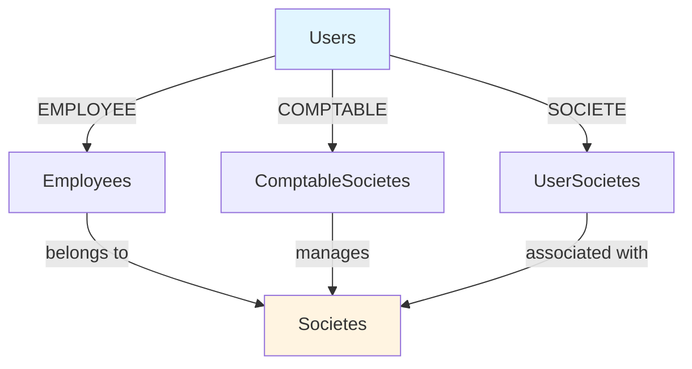

# Authorization Service - AGENTS Documentation

## Overview

The **Authorization Service** (authz-service) is responsible for managing company and employee authorization relationships in the COMPTA ERP system. It handles company registration, employee-company associations, and accountant-company assignments.

**Service Name:** authz-service  
**Port:** 8082  
**Context Path:** `/authz`  
**Database Schema:** `authz`

---

## Purpose and Responsibilities

The Authorization Service provides the following core functionality:

- **Company Management**: Create, update, and manage company profiles with legal and contact information
- **Employee-Company Relationships**: Link employees to companies with employment details
- **Accountant-Company Assignments**: Assign accountants to manage multiple companies
- **User-Company Associations**: Link users to their associated companies
- **Authorization Context**: Provide company-based authorization context for other services

---

## Technologies and Frameworks

### Core Framework
- **Spring Boot 3.x** - Application framework
- **Java 21** - Programming language

### Database & ORM
- **PostgreSQL** - Primary database
- **Flyway** - Database migration management
- **jOOQ** - Type-safe SQL query builder (code generation enabled)

### Build Tools
- **Maven** - Build and dependency management

### Documentation
- **SpringDoc OpenAPI** - API documentation (Swagger UI)

### Monitoring & Observability
- **Sentry** - Error tracking and performance monitoring
- **Spring Boot Actuator** - Health checks and metrics (via compta-commons)

### Testing
- **Spring Boot Test** - Testing framework
- **Testcontainers** - Integration testing with PostgreSQL
- **JUnit 5** - Unit testing

### Development
- **Lombok** - Reduce boilerplate code

---

## API Endpoints

> **Note:** This service is in early development. Only test endpoints are currently implemented.

### Current Endpoints

| Method | Path | Description | Authentication |
|--------|------|-------------|----------------|
| GET | `/authz/api/authz/tt` | Test endpoint for authentication verification | Required |

### Planned Endpoints

| Method | Path | Description | Authentication |
|--------|------|-------------|----------------|
| GET | `/authz/api/societes` | List all companies | Required |
| POST | `/authz/api/societes` | Create a new company | Required |
| GET | `/authz/api/societes/{id}` | Get company details | Required |
| PUT | `/authz/api/societes/{id}` | Update company information | Required |
| DELETE | `/authz/api/societes/{id}` | Delete a company | Required |
| GET | `/authz/api/societes/{id}/employees` | List employees of a company | Required |
| POST | `/authz/api/societes/{id}/employees` | Add employee to company | Required |
| GET | `/authz/api/societes/{id}/comptables` | List accountants for a company | Required |
| POST | `/authz/api/societes/{id}/comptables` | Assign accountant to company | Required |
| GET | `/authz/api/employees/{id}` | Get employee details | Required |
| PUT | `/authz/api/employees/{id}` | Update employee information | Required |
| DELETE | `/authz/api/employees/{id}` | Remove employee from company | Required |

---

## Dependencies on Other Services

### External Dependencies
- **PostgreSQL Database** - Stores authorization data in the `authz` schema

### Internal Dependencies
- **compta-commons** - Shared utilities, security, and common configurations

### Service Dependencies
- **Auth Service** - Validates JWT tokens for user authentication (via compta-commons security module)

---

## Configuration Details

### Application Configuration (`application.yml`)

```yaml
spring:
  application:
    name: authz-service
  datasource:
    url: jdbc:postgresql://localhost:5432/compta
    username: postgres
    password: password
    driver-class-name: org.postgresql.Driver
  flyway:
    enabled: true
    schemas: authz
    default-schema: authz

server:
  port: 8082
  forward-headers-strategy: framework
  servlet:
    context-path: /authz

compta:
  security:
    enabled: true
    public-paths: /actuator/**,/v3/api-docs/**,/swagger-ui/**,/authz/v3/api-docs/**,/authz/swagger-ui/**

springdoc:
  api-docs:
    enabled: true
    path: /v3/api-docs
  swagger-ui:
    enabled: true
    path: /swagger-ui.html
    operations-sorter: method
    tags-sorter: alpha
  info:
    title: Auth Service API
    version: 1.0.0
    description: Service d'authentification et de gestion des utilisateurs
```

### Environment Variables

| Variable | Description | Default |
|----------|-------------|---------|
| `SENTRY_DSN` | Sentry DSN for error tracking | (empty) |
| `SENTRY_ENVIRONMENT` | Sentry environment name | `development` |

---

## Database Schema

### Schema: `authz`

#### Tables

##### `societes`
Company profiles with legal and contact information.

| Column | Type | Description |
|--------|------|-------------|
| `id` | BIGSERIAL | Primary key |
| `raison_sociale` | VARCHAR(255) | Company legal name (NOT NULL) |
| `matricule_fiscale` | VARCHAR(13) | Tax identification number (NOT NULL, UNIQUE) |
| `code_tva` | VARCHAR(20) | VAT code |
| `code_douane` | VARCHAR(20) | Customs code |
| `registre_commerce` | VARCHAR(50) | Trade registry number |
| `forme_juridique` | VARCHAR(100) | Legal form (SARL, SA, etc.) |
| `capital_social` | NUMERIC(15,2) | Share capital |
| `date_creation` | DATE | Company creation date |
| `adresse` | VARCHAR(255) | Street address |
| `ville` | VARCHAR(100) | City |
| `code_postal` | VARCHAR(10) | Postal code |
| `telephone` | VARCHAR(20) | Phone number |
| `fax` | VARCHAR(20) | Fax number |
| `email` | VARCHAR(255) | Email address |
| `site_web` | VARCHAR(255) | Website URL |
| `activite` | VARCHAR(255) | Business activity description |
| `secteur` | VARCHAR(100) | Business sector |
| `is_active` | BOOLEAN | Active status (default: TRUE) |
| `created_at` | TIMESTAMP | Creation timestamp |
| `updated_at` | TIMESTAMP | Last update timestamp |
| `created_by` | BIGINT | User who created the record |
| `updated_by` | BIGINT | User who last updated the record |

**Constraints:**
- UNIQUE on `matricule_fiscale`

**Indexes:**
- `idx_societes_matricule` on `matricule_fiscale`
- `idx_societes_is_active` on `is_active`

##### `employees`
Employee-company relationships with employment details.

| Column | Type | Description |
|--------|------|-------------|
| `id` | BIGSERIAL | Primary key |
| `user_id` | BIGINT | Foreign key to auth.users (NOT NULL, UNIQUE) |
| `societe_id` | BIGINT | Foreign key to societes (NOT NULL) |
| `matricule_employee` | VARCHAR(50) | Employee identifier |
| `poste` | VARCHAR(100) | Job title/position |
| `departement` | VARCHAR(100) | Department |
| `date_embauche` | DATE | Hire date |
| `date_fin_contrat` | DATE | Contract end date |
| `type_contrat` | VARCHAR(50) | Contract type (CDI, CDD, etc.) |
| `is_active` | BOOLEAN | Active status (default: TRUE) |
| `created_at` | TIMESTAMP | Creation timestamp |
| `updated_at` | TIMESTAMP | Last update timestamp |

**Constraints:**
- UNIQUE on `user_id` (one employee record per user)
- Foreign key to `societes(id)`

**Indexes:**
- `idx_employees_societe_id` on `societe_id`
- `idx_employees_user_id` on `user_id`

##### `comptable_societes`
Accountant-company assignments (many-to-many relationship).

| Column | Type | Description |
|--------|------|-------------|
| `id` | BIGSERIAL | Primary key |
| `comptable_id` | BIGINT | Foreign key to auth.users (accountant) |
| `societe_id` | BIGINT | Foreign key to societes (NOT NULL) |
| `is_active` | BOOLEAN | Active status (default: TRUE) |
| `created_at` | TIMESTAMP | Assignment timestamp |

**Constraints:**
- UNIQUE on `(comptable_id, societe_id)`
- Foreign key to `societes(id)` with CASCADE DELETE

##### `user_societes`
User-company associations for general access control.

| Column | Type | Description |
|--------|------|-------------|
| `id` | BIGSERIAL | Primary key |
| `user_id` | BIGINT | Foreign key to auth.users |
| `societe_id` | BIGINT | Foreign key to societes (NOT NULL) |
| `role` | VARCHAR(50) | User role in this company context |
| `is_active` | BOOLEAN | Active status (default: TRUE) |
| `created_at` | TIMESTAMP | Association timestamp |

**Constraints:**
- UNIQUE on `(user_id, societe_id)`
- Foreign key to `societes(id)` with CASCADE DELETE

---

## Key Classes and Responsibilities

### Main Application Class
- **`AuthzServiceApplication`** - Spring Boot application entry point

### Configuration Classes

#### `config/`
- **`OpenApiConfig`** - Swagger/OpenAPI documentation configuration

### Controllers

#### `controller/`
- **`TtController`** - Test endpoint for authentication verification

### DTOs

#### `dto/`
- **`CreateSocieteRequest`** - Company creation data
- **`UpdateSocieteRequest`** - Company update data
- **`CreateEmployeeRequest`** - Employee creation data
- **`ComptableSocieteRequest`** - Accountant-company assignment data
- **`UserSocieteRequest`** - User-company association data

### Repositories (jOOQ-generated)

#### `repository/`
- **`SocieteRepository`** - Company data access operations
- **`EmployeeRepository`** - Employee data access operations
- **`ComptableSocieteRepository`** - Accountant-company relationship operations
- **`UserSocieteRepository`** - User-company association operations

---

## Authorization Model

The authorization service implements a multi-level authorization model:



### User Roles in Company Context

| User Type | Table | Relationship | Permissions |
|-----------|-------|--------------|-------------|
| **EMPLOYEE** | `employees` | One-to-one with company | Limited to assigned company data |
| **COMPTABLE** | `comptable_societes` | Many-to-many with companies | Full access to assigned companies |
| **SOCIETE** | `user_societes` | Many-to-many with companies | Owner access to associated companies |

---

## Development Notes

### Running the Service

```bash
# Build the service
mvn clean install

# Run the service
mvn spring-boot:run

# Or run with specific profile
mvn spring-boot:run -Dspring-boot.run.profiles=dev
```

### Accessing API Documentation

Swagger UI is available at:
- Development: `http://localhost:8082/authz/swagger-ui.html`
- API Docs: `http://localhost:8082/authz/v3/api-docs`

### Database Migration

Flyway migrations are located in `src/main/resources/db/migration/`

To add a new migration:
1. Create a new SQL file with version prefix (e.g., `V1__init_authz_schema.sql`)
2. Flyway will automatically apply it on startup

### jOOQ Code Generation

The service uses jOOQ for type-safe SQL queries. Code is generated from the database schema:

```xml
<properties>
  <jooq.generator.db.schema>authz</jooq.generator.db.schema>
  <jooq.generator.target.package>tn.cyberious.compta.authz.generated</jooq.generator.target.package>
</properties>
```

Generated classes are placed in `src/generated/jooq/`

### Testing

Integration tests use Testcontainers with PostgreSQL:

```bash
# Run tests
mvn test
```

---

## Security

The service uses the shared security module from `compta-commons`:

- JWT-based authentication
- Role-based access control (RBAC)
- Public endpoints for health checks and API documentation
- Protected endpoints for all business operations

### Public Paths
- `/actuator/**` - Health checks and metrics
- `/v3/api-docs/**` - OpenAPI documentation
- `/swagger-ui/**` - Swagger UI

---

## Monitoring

### Sentry Integration
- Error tracking enabled
- Distributed tracing with 10% sampling
- Service tags: `service=authz-service`, `module=authz`

### Health Checks
Available via Spring Boot Actuator (configured in compta-commons)

---

## Integration with Other Services

### Auth Service Integration
The authz-service depends on the auth-service for:
- User authentication via JWT tokens
- User profile information
- Role validation

### Accounting Service Integration
The accounting-service will use the authz-service for:
- Company context validation
- Employee-company relationship verification
- Accountant authorization checks

---

## Future Enhancements

- Implement REST API controllers for companies
- Implement REST API controllers for employees
- Implement REST API controllers for accountant assignments
- Add business logic services
- Create DTOs for all request/response types
- Implement company search and filtering
- Add employee management workflows
- Implement accountant assignment workflows
- Add audit logging for authorization changes
- Implement company-level permissions
- Add bulk operations for employee management
- Implement company hierarchy support
- Add company status management (active, suspended, archived)
