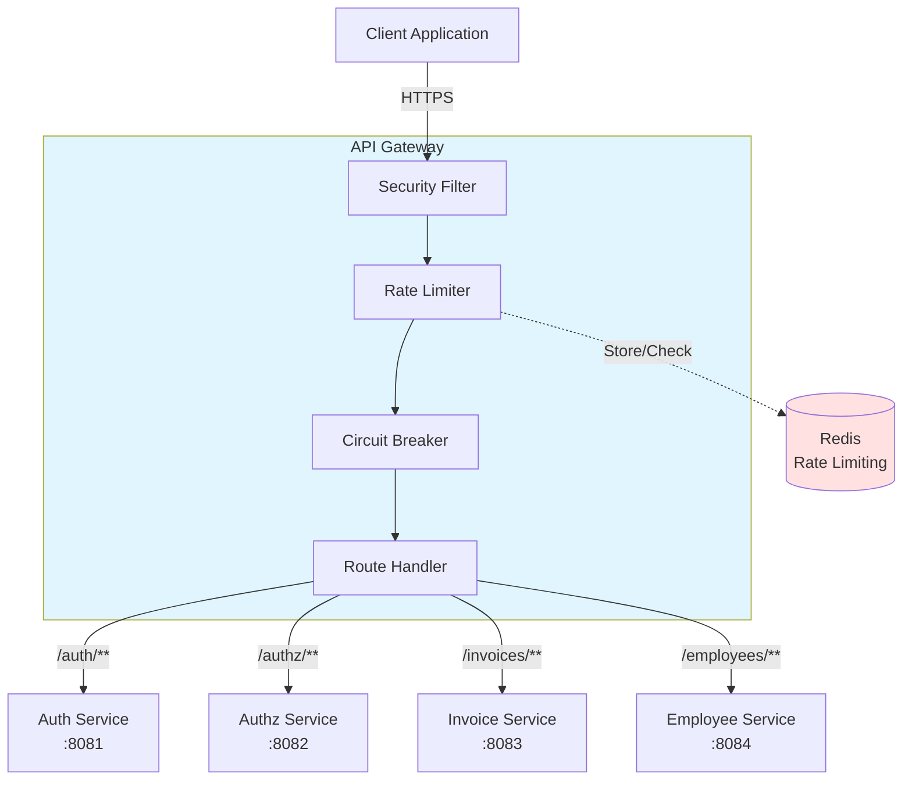
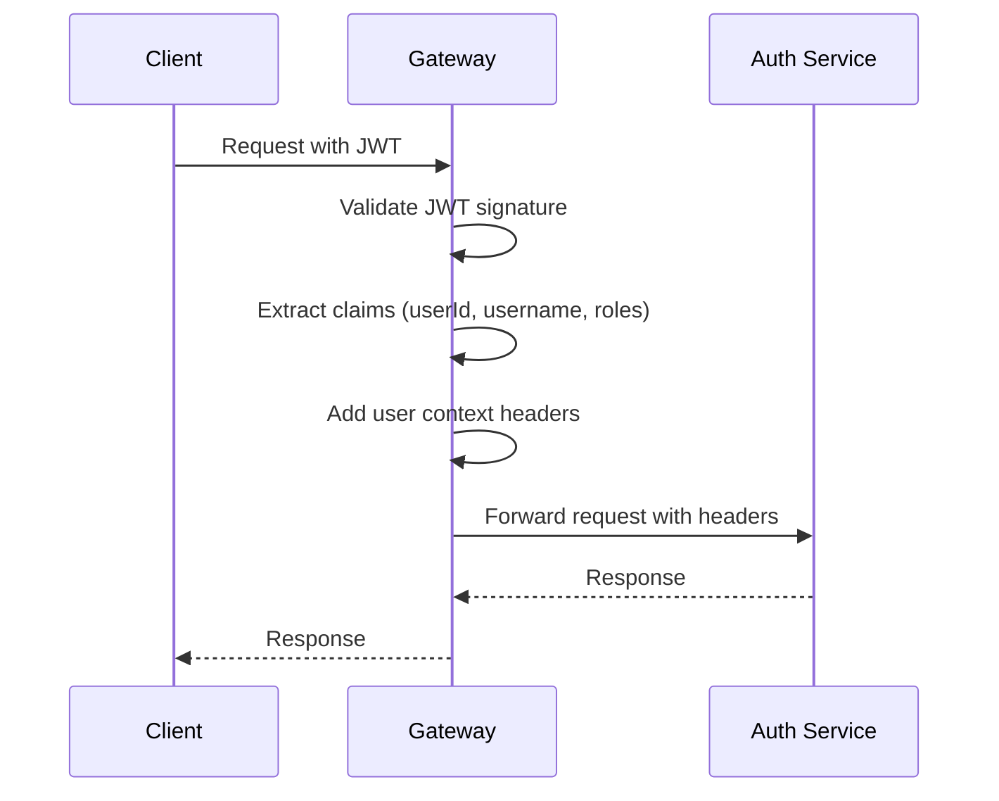

# Gateway Service - AGENTS Documentation

## Overview

The **Gateway Service** is the API Gateway for the COMPTA ERP system. It serves as the single entry point for all client requests, providing routing, security, rate limiting, circuit breaking, and monitoring capabilities.

**Service Name:** gateway-service  
**Port:** 8080  
**Context Path:** / (root)  
**Type:** Spring Cloud Gateway (Reactive)

---

## Purpose and Responsibilities

The Gateway Service provides the following core functionality:

- **Request Routing**: Route requests to appropriate microservices based on URL paths
- **Authentication & Authorization**: Validate JWT tokens and enforce security policies
- **Rate Limiting**: Prevent abuse by limiting request rates per user/IP using Redis
- **Circuit Breaking**: Implement fault tolerance with graceful degradation when services fail
- **CORS Management**: Handle cross-origin resource sharing policies
- **Request/Response Transformation**: Add user context headers to downstream requests
- **Distributed Tracing**: Enable end-to-end request tracing across services
- **API Documentation**: Aggregate Swagger/OpenAPI documentation from all services
- **Health Monitoring**: Monitor downstream service health and provide unified health checks
- **Security Headers**: Add security headers to all responses

---

## Technologies and Frameworks

### Core Framework
- **Spring Boot 3.5.9** - Application framework
- **Spring Cloud Gateway** - Reactive API Gateway
- **Spring WebFlux** - Reactive programming model
- **Java 21** - Programming language

### Security
- **Spring Security** - Security framework for reactive applications
- **OAuth2 Resource Server** - JWT token validation
- **Spring Security WebFlux** - Reactive security support

### Resilience & Fault Tolerance
- **Resilience4j** - Circuit breaker and retry mechanisms
  - Circuit breaker for service availability
  - Time limiter for request timeouts
  - Retry for transient failures

### Rate Limiting
- **Spring Data Redis Reactive** - Redis integration for rate limiting
- **Redis Lettuce** - Redis client with connection pooling

### Monitoring & Observability
- **Spring Boot Actuator** - Health checks, metrics, and monitoring
- **Micrometer** - Metrics collection
- **Prometheus** - Metrics export
- **OpenTelemetry** - Distributed tracing
- **Micrometer Tracing Bridge** - Tracing integration

### Documentation
- **SpringDoc OpenAPI** - API documentation aggregation
- **Swagger UI** - Interactive API documentation

### Development
- **Lombok** - Reduce boilerplate code
- **Spring Boot DevTools** - Hot reload during development

### Testing
- **Spring Boot Test** - Testing framework
- **Reactor Test** - Reactive testing support
- **Spring Security Test** - Security testing

---

## Architecture Overview



---

## API Routes

### Route Configuration

| Route ID | Path Pattern | Target Service | Port | Rate Limit | Timeout |
|----------|---------------|----------------|-------|------------|----------|
| `auth-service` | `/auth/**` | Auth Service | 8081 | 10 req/s (burst 20) | 10s |
| `authz-service` | `/authz/**` | Authz Service | 8082 | 20 req/s (burst 40) | 5s |
| `invoice-service` | `/invoices/**` | Invoice Service | 8083 | 15 req/s (burst 30) | 15s |
| `employee-service` | `/employees/**` | Employee Service | 8084 | 20 req/s (burst 40) | 5s |

### Route Features

Each route includes:
- **Circuit Breaker**: Automatic fallback when service is unavailable
- **Rate Limiting**: Redis-based request throttling
- **Retry**: Automatic retry for transient failures (3 attempts for GET/PUT)
- **Response Timeout**: Configurable per-service timeout

---

## Gateway Endpoints

### Public Endpoints (No Authentication Required)

| Method | Path | Description |
|--------|------|-------------|
| GET | `/actuator/health` | Health check |
| GET | `/actuator/info` | Application info |
| GET | `/actuator/metrics` | Metrics endpoint |
| GET | `/actuator/prometheus` | Prometheus metrics |
| GET | `/actuator/circuitbreakers` | Circuit breaker status |
| GET | `/actuator/circuitbreakerevents` | Circuit breaker events |
| GET | `/v3/api-docs` | Gateway OpenAPI docs |
| GET | `/swagger-ui.html` | Swagger UI |
| GET | `/swagger-ui/**` | Swagger UI resources |

### Fallback Endpoints

| Method | Path | Description |
|--------|------|-------------|
| GET/POST/PUT/DELETE/PATCH | `/fallback/auth` | Auth service fallback |
| GET/POST/PUT/DELETE/PATCH | `/fallback/authz` | Authz service fallback |
| GET/POST/PUT/DELETE/PATCH | `/fallback/invoices` | Invoice service fallback |
| GET/POST/PUT/DELETE/PATCH | `/fallback/employees` | Employee service fallback |
| GET/POST/PUT/DELETE/PATCH | `/fallback/generic` | Generic fallback |

---

## Dependencies on Other Services

### Downstream Services
- **Auth Service** (`http://localhost:8081`) - User authentication
- **Authz Service** (`http://localhost:8082`) - Authorization management
- **Invoice Service** (`http://localhost:8083`) - Invoice management
- **Employee Service** (`http://localhost:8084`) - Employee management

### Infrastructure Dependencies
- **Redis** - Rate limiting storage (required for production)
- **PostgreSQL** - No direct dependency (services use their own databases)

---

## Configuration Details

### Application Configuration (`application.yml`)

```yaml
server:
  port: 8080
  compression:
    enabled: true
    mime-types: application/json,application/xml,text/html,text/xml,text/plain,application/javascript,text/css
    min-response-size: 1024
  shutdown: graceful

spring:
  lifecycle:
    timeout-per-shutdown-phase: 30s
  data:
    redis:
      host: ${REDIS_HOST:localhost}
      port: ${REDIS_PORT:6379}
      password: ${REDIS_PASSWORD:}
      lettuce:
        pool:
          max-active: 8
          max-idle: 8
          min-idle: 0
          max-wait: -1ms
  application:
    name: gateway-service

jwt:
  secret: ${JWT_SECRET:404E635266556A586E3272357538782F413F4428472B4B6250645367566B5970}
  expiration: ${JWT_EXPIRATION:86400000}
  refresh-expiration: ${JWT_REFRESH_EXPIRATION:604800000}

cors:
  allowed-origins:
    - http://localhost:3000
    - http://localhost:4200
    - http://localhost:8080
  max-age: 3600

resilience4j:
  circuitbreaker:
    configs:
      default:
        registerHealthIndicator: true
        slidingWindowSize: 10
        minimumNumberOfCalls: 5
        permittedNumberOfCallsInHalfOpenState: 3
        automaticTransitionFromOpenToHalfOpenEnabled: true
        waitDurationInOpenState: 30s
        failureRateThreshold: 50
    instances:
      authService:
        failureRateThreshold: 30
        waitDurationInOpenState: 60s
      authzService:
        failureRateThreshold: 40
        waitDurationInOpenState: 30s
      invoiceService:
        failureRateThreshold: 60
        slowCallDurationThreshold: 20s
      employeeService:
        failureRateThreshold: 50
        waitDurationInOpenState: 30s

springdoc:
  api-docs:
    enabled: true
    path: /v3/api-docs
  swagger-ui:
    enabled: true
    path: /swagger-ui.html
    urls:
      - name: Gateway
        url: /v3/api-docs
      - name: Auth Service
        url: /auth/v3/api-docs
      - name: Authz Service
        url: /authz/v3/api-docs
      - name: Invoice Service
        url: /invoices/v3/api-docs
      - name: Employee Service
        url: /employees/v3/api-docs

management:
  endpoints:
    web:
      exposure:
        include: health,info,metrics,prometheus,circuitbreakers,circuitbreakerevents
  endpoint:
    health:
      show-details: when-authorized
      show-components: when-authorized
  health:
    circuitbreakers:
      enabled: true
  tracing:
    enabled: true
    sampling:
      probability: 1.0
    propagation:
      type: w3c
```

### Environment Variables

| Variable | Description | Default |
|----------|-------------|---------|
| `SPRING_PROFILES_ACTIVE` | Spring profile (dev/prod) | `dev` |
| `JWT_SECRET` | JWT signing secret (64+ chars recommended for production) | `404E635266556A586E3272357538782F413F4428472B4B6250645367566B5970` |
| `JWT_EXPIRATION` | Access token expiration in milliseconds | `86400000` (24 hours) |
| `JWT_REFRESH_EXPIRATION` | Refresh token expiration in milliseconds | `604800000` (7 days) |
| `AUTH_SERVICE_URL` | Auth service URL | `http://localhost:8081` |
| `AUTHZ_SERVICE_URL` | Authz service URL | `http://localhost:8082` |
| `INVOICE_SERVICE_URL` | Invoice service URL | `http://localhost:8083` |
| `EMPLOYEE_SERVICE_URL` | Employee service URL | `http://localhost:8084` |
| `GATEWAY_URL` | Gateway URL for OpenAPI | `http://localhost:8080` |
| `REDIS_HOST` | Redis server host | `localhost` |
| `REDIS_PORT` | Redis server port | `6379` |
| `REDIS_PASSWORD` | Redis password | (empty) |
| `CORS_ALLOWED_ORIGINS` | Comma-separated allowed origins | `http://localhost:3000,http://localhost:4200` |

---

## Key Classes and Responsibilities

### Main Application Class
- **`GatewayApplication`** - Spring Boot application entry point

### Configuration Classes

#### `config/`
- **`SecurityConfig`** - Spring Security OAuth2 Resource Server configuration
- **`CorsConfig`** - CORS configuration for cross-origin requests
- **`RateLimitConfig`** - Rate limiting with Redis key resolver
- **`OpenApiConfig`** - Swagger/OpenAPI aggregation configuration
- **`WebClientConfig`** - WebClient configuration for health checks
- **`WebPropertiesConfig`** - Web properties configuration
- **`JwtConfigValidator`** - JWT configuration validation
- **`PublicEndpoints`** - Public endpoint path definitions
- **`ProfileHelper`** - Profile-specific configuration helper

### Controllers

#### `controller/`
- **`FallbackController`** - Circuit breaker fallback endpoints

### Filters

#### `filter/`
- **`JwtToHeadersGatewayFilter`** - Extracts JWT claims and adds as HTTP headers
- **`StripUserHeadersFilter`** - Strips user headers from responses
- **`SecureLoggingGlobalFilter`** - Secure logging with sensitive data masking
- **`SecurityHeadersFilter`** - Adds security headers to responses

### Exception Handling

#### `exception/`
- **`GlobalErrorWebExceptionHandler`** - Global exception handler
- **`JwtAuthenticationEntryPoint`** - JWT authentication error handling

### Health Monitoring

#### `health/`
- **`DownstreamServicesHealthIndicator`** - Custom health indicator for downstream services

---

## Security Implementation

### JWT Token Validation

The gateway uses OAuth2 Resource Server to validate JWT tokens:



### User Context Headers

The gateway adds the following headers to authenticated requests:

| Header | Description | Source |
|--------|-------------|--------|
| `X-User-Id` | User ID from JWT subject | JWT `sub` claim |
| `X-User-Username` | Username | JWT `username` claim |
| `X-User-Email` | User email | JWT `email` claim |
| `X-User-Roles` | Comma-separated roles | JWT `roles` claim |
| `X-Tenant-Id` | Tenant/Company ID | JWT `tenantId` claim |

### Public Endpoints

The following paths are publicly accessible (no authentication required):
- `/actuator/**` - Health checks and metrics
- `/v3/api-docs/**` - OpenAPI documentation
- `/swagger-ui/**` - Swagger UI

All other paths require valid JWT authentication.

---

## Rate Limiting

### Implementation

Rate limiting is implemented using Redis with the following strategy:

1. **Authenticated Users**: Rate limit by user ID
2. **Anonymous Users**: Rate limit by IP address

### Rate Limits per Service

| Service | Replenish Rate | Burst Capacity |
|----------|----------------|----------------|
| Auth Service | 10 req/s | 20 |
| Authz Service | 20 req/s | 40 |
| Invoice Service | 15 req/s | 30 |
| Employee Service | 20 req/s | 40 |

### Redis Configuration

```yaml
spring:
  data:
    redis:
      host: ${REDIS_HOST:localhost}
      port: ${REDIS_PORT:6379}
      password: ${REDIS_PASSWORD:}
      lettuce:
        pool:
          max-active: 8
          max-idle: 8
          min-idle: 0
```

---

## Circuit Breaking

### Resilience4j Circuit Breaker

Each downstream service has a dedicated circuit breaker:

| Service | Failure Threshold | Wait Duration | Slow Call Threshold |
|---------|------------------|---------------|---------------------|
| Auth Service | 30% | 60s | 10s |
| Authz Service | 40% | 30s | 10s |
| Invoice Service | 60% | 30s | 20s |
| Employee Service | 50% | 30s | 10s |

### Circuit Breaker States

1. **Closed**: Normal operation, requests pass through
2. **Open**: Circuit is tripped, requests fail fast
3. **Half-Open**: Testing if service has recovered

### Fallback Responses

When a circuit breaker is open, the gateway returns a fallback response:

```json
{
  "timestamp": "2024-01-01T12:00:00Z",
  "status": 503,
  "error": "Service Unavailable",
  "message": "Le service demandé est temporairement indisponible. Veuillez réessayer dans quelques instants.",
  "service": "service-name"
}
```

---

## Distributed Tracing

### OpenTelemetry Integration

The gateway uses OpenTelemetry for distributed tracing:

```yaml
management:
  tracing:
    enabled: true
    sampling:
      probability: 1.0  # 100% sampling
    propagation:
      type: w3c  # W3C trace context format
```

### Trace Context

Each request includes:
- **traceId**: Unique identifier for the entire request flow
- **spanId**: Identifier for the current operation
- **parentSpanId**: Parent operation identifier

These are propagated to all downstream services via HTTP headers.

---

## API Documentation

### Swagger UI Aggregation

The gateway aggregates OpenAPI documentation from all services:

- **Gateway URL**: `http://localhost:8080/swagger-ui.html`
- **Services Documented**:
  - Gateway (internal routes)
  - Auth Service
  - Authz Service
  - Invoice Service
  - Employee Service

### OpenAPI Endpoints

| Endpoint | Description |
|----------|-------------|
| `/v3/api-docs` | Gateway OpenAPI spec |
| `/auth/v3/api-docs` | Auth Service spec |
| `/authz/v3/api-docs` | Authz Service spec |
| `/invoices/v3/api-docs` | Invoice Service spec |
| `/employees/v3/api-docs` | Employee Service spec |

---

## Development Notes

### Running the Gateway

```bash
# Build the gateway
mvn clean install

# Run the gateway
mvn spring-boot:run

# Run with specific profile
mvn spring-boot:run -Dspring-boot.run.profiles=dev

# Run with environment variables
export JWT_SECRET=your-secret-key
export REDIS_HOST=localhost
mvn spring-boot:run
```

### Using Docker

```bash
# Build Docker image
docker build -t compta-gateway .

# Run with Docker Compose
docker-compose up -d

# Run standalone
docker run -p 8080:8080 \
  -e JWT_SECRET=your-secret \
  -e REDIS_HOST=redis \
  compta-gateway
```

### Accessing the Gateway

- **Gateway**: `http://localhost:8080`
- **Swagger UI**: `http://localhost:8080/swagger-ui.html`
- **Health Check**: `http://localhost:8080/actuator/health`
- **Metrics**: `http://localhost:8080/actuator/prometheus`

---

## Monitoring

### Health Checks

```bash
# Overall health
curl http://localhost:8080/actuator/health

# Circuit breaker status
curl http://localhost:8080/actuator/circuitbreakers

# Circuit breaker events
curl http://localhost:8080/actuator/circuitbreakerevents
```

### Prometheus Metrics

Metrics are available at `/actuator/prometheus`:

- `http_server_requests_*` - HTTP request metrics
- `resilience4j_circuitbreaker_*` - Circuit breaker metrics
- `redis_*` - Redis connection metrics

### Distributed Tracing

Traces are exported using OpenTelemetry. Configure your tracing backend (Jaeger, Zipkin, etc.) to receive traces.

---

## Migration to OAuth2

The gateway currently uses JWT validation directly and needs to be migrated to full OAuth2:

1. **Current State**: Validates JWT tokens using shared secret
2. **Target State**: OAuth2 Resource Server with OAuth2 provider integration

### Required Changes

- Integrate with OAuth2 authorization server (e.g., Keycloak, Auth0)
- Support OAuth2 flows (Authorization Code, Client Credentials)
- Implement token introspection
- Update JWT decoder to use OAuth2 provider's public keys
- Maintain backward compatibility during transition

---

## Performance Tuning

### Connection Pooling

```yaml
spring:
  cloud:
    gateway:
      server:
        webflux:
          httpclient:
            pool:
              max-connections: 100
              max-idle-time: 30s
```

### Response Compression

Enabled by default for:
- `application/json`
- `application/xml`
- `text/html`
- `text/xml`
- `text/plain`
- `application/javascript`
- `text/css`

### Graceful Shutdown

```yaml
server:
  shutdown: graceful

spring:
  lifecycle:
    timeout-per-shutdown-phase: 30s
```

---

## Security Best Practices

1. **JWT Secret**: Always use strong, randomly generated secrets (64+ characters)
2. **HTTPS**: Use HTTPS in production
3. **CORS**: Restrict allowed origins to trusted domains
4. **Rate Limiting**: Enable Redis-based rate limiting in production
5. **Security Headers**: All responses include security headers
6. **Input Validation**: Validate all incoming requests
7. **Error Messages**: Don't expose sensitive information in error messages

---

## Future Enhancements

- Implement OAuth2 authorization server integration
- Add request/response transformation capabilities
- Implement API versioning strategy
- Add WebSocket support for real-time features
- Implement API key authentication for service-to-service communication
- Add request/response logging for audit trails
- Implement advanced rate limiting strategies (sliding window, token bucket)
- Add service discovery integration (Eureka, Consul)
- Implement blue-green deployment support
- Add API gateway analytics dashboard
