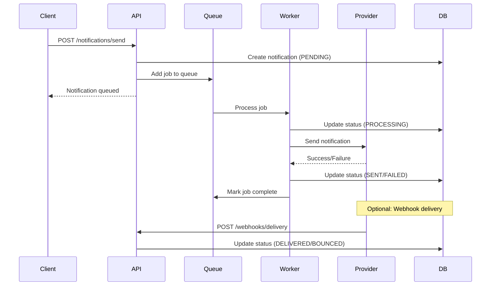

# Notification Service - AGENTS Documentation

## Overview

The **Notification Service** is responsible for managing and delivering notifications in the COMPTA ERP system. It handles email, SMS, push notifications, and in-app notifications using a queue-based architecture for reliable delivery.

**Service Name:** notification-service  
**Port:** 3000 (default)  
**Database Schema:** `notification`  
**Queue System:** BullMQ with Redis  

---

## Purpose and Responsibilities

The Notification Service provides the following core functionality:

- **Multi-Channel Notifications**: Email, SMS, Push, and In-App notifications
- **Queue-Based Processing**: Asynchronous job processing with BullMQ and Redis
- **Email Delivery**: SMTP-based email sending with MJML templates
- **Notification Templates**: Template management with MJML for responsive emails
- **User Preferences**: Granular notification preferences per channel and type
- **Notification Tracking**: Detailed status tracking (PENDING, QUEUED, PROCESSING, SENT, DELIVERED, FAILED, BOUNCED, CANCELLED)
- **Retry Management**: Automatic retry with configurable attempts and delays
- **Statistics & Analytics**: Aggregated notification statistics and metrics
- **Webhook Integration**: Delivery confirmation via webhooks from providers
- **Queue Monitoring**: Bull Board UI for monitoring queues and jobs

---

## Technologies and Frameworks

### Core Framework
- **NestJS 11.x** - Node.js application framework
- **TypeScript 5.x** - Programming language
- **Node.js** - Runtime environment

### Database & ORM
- **PostgreSQL** - Primary database
- **Prisma 7.x** - Type-safe ORM with code generation
- **Prisma Client** - Database query builder

### Queue System
- **BullMQ 5.x** - Job queue system
- **Redis** - Queue backend and caching
- **@nestjs/bullmq** - NestJS integration for BullMQ
- **Bull Board** - Queue monitoring UI

### Email & Messaging
- **Nodemailer 7.x** - Email sending library (via @nestjs-modules/mailer)
- **@nestjs-modules/mailer** - NestJS mailer module for SMTP email sending
- **MJML 4.x** - Email template engine for responsive emails
- **SendPulse API** - Third-party email service (via native fetch API)

### Build Tools
- **pnpm** - Package manager
- **NestJS CLI** - Development and build tools

### Documentation
- **@nestjs/swagger** - API documentation (Swagger/OpenAPI)

### Testing
- **Jest** - Testing framework
- **Supertest** - HTTP endpoint testing

### Code Quality
- **ESLint 9.x** - Code linting
- **Prettier** - Code formatting

---

## API Endpoints

**Note:** All endpoints are prefixed with `/notif/` (e.g., `/notif/health`, `/notif/notifications`).

### Health Endpoints

| Method | Path | Description | Authentication |
|--------|------|-------------|----------------|
| GET | `/notif/health` | Overall service health | None |
| GET | `/notif/health/redis` | Redis connection health | None |

### Notification Endpoints

| Method | Path | Description | Authentication |
|--------|------|-------------|----------------|
| GET | `/notif/notifications` | List notifications with filters | Gateway |
| GET | `/notif/notifications/:id` | Get notification by ID | Gateway |
| POST | `/notif/notifications` | Create new notification | Gateway |
| PATCH | `/notif/notifications/:id/status` | Update notification status | Gateway |
| GET | `/notif/notifications/stats/global` | Get global statistics | Gateway |
| GET | `/notif/notifications/scheduled/ready` | Get scheduled notifications ready to send | Gateway |
| GET | `/notif/notifications/failed/retryable` | Get retryable failed notifications | Gateway |
| DELETE | `/notif/notifications/cleanup/:days` | Clean up old notifications | Gateway |

### User Endpoints

| Method | Path | Description | Authentication |
|--------|------|-------------|----------------|
| GET | `/notif/users` | List all users | Gateway |
| GET | `/notif/users/:id` | Get user by ID | Gateway |
| GET | `/notif/users/email/:email` | Get user by email | Gateway |
| POST | `/notif/users` | Create user | Gateway |
| PATCH | `/notif/users/:id` | Update user | Gateway |
| PATCH | `/notif/users/:id/preferences` | Update user notification preferences | Gateway |
| GET | `/notif/users/:id/stats` | Get user notification statistics | Gateway |
| DELETE | `/notif/users/:id` | Delete user | Gateway |

### Template Endpoints

| Method | Path | Description | Authentication |
|--------|------|-------------|----------------|
| GET | `/notif/templates` | List all templates | Gateway |
| GET | `/notif/templates/:id` | Get template by ID | Gateway |
| GET | `/notif/templates/code/:code` | Get active template by code | Gateway |
| GET | `/notif/templates/code/:code/versions` | Get all versions of a template | Gateway |
| POST | `/notif/templates` | Create template | Gateway |
| PATCH | `/notif/templates/:id` | Update template | Gateway |
| PATCH | `/notif/templates/:id/active` | Activate/deactivate template | Gateway |
| DELETE | `/notif/templates/:id` | Delete template | Gateway |

### Statistics Endpoints

| Method | Path | Description | Authentication |
|--------|------|-------------|----------------|
| GET | `/notif/stats/daily` | Get daily statistics | Gateway |
| GET | `/notif/stats/summary` | Get global summary | Gateway |
| GET | `/notif/stats/success-rate` | Get success rate | Gateway |
| POST | `/notif/stats/aggregate` | Aggregate statistics from notifications | Gateway |

### Queue Monitoring

| Method | Path | Description | Authentication |
|--------|------|-------------|----------------|
| GET | `/notif/queues` | Bull Board UI for queue monitoring | None |

**Note:** The Bull Board UI route is configured as `/queues` in the module, but with the global prefix `/notif`, it becomes accessible at `/notif/queues`.

---

## Dependencies on Other Services

### External Dependencies
- **PostgreSQL Database** - Stores notifications, users, templates, and statistics
- **Redis Server** - Queue backend for BullMQ

### Internal Dependencies
- **@compta/notification-contracts** - Shared contracts and queue names
- **auth-service** - User authentication and authorization (via JWT)
- **oauth2-server** - OAuth2 token management (for email verification and password reset)

### Service-to-Service Communication
The Notification Service receives jobs from other services via BullMQ queues:
- **EMAIL_VERIFICATION queue** - From oauth2-server for email verification
- **PASSWORD_RESET queue** - From oauth2-server for password reset

---

## Configuration Details

### Application Configuration

Configuration is managed through environment variables (see `.env.example`).

### Environment Variables

| Variable | Description | Default |
|----------|-------------|---------|
| `PORT` | Service port | `3000` |
| `DATABASE_URL` | PostgreSQL connection string | (required) |
| `REDIS_HOST` | Redis host | `localhost` |
| `REDIS_PORT` | Redis port | `6379` |
| `SMTP_HOST` | SMTP server host | (required) |
| `SMTP_PORT` | SMTP server port | `587` |
| `SMTP_USER` | SMTP username | (required) |
| `SMTP_PASSWORD` | SMTP password | (required) |
| `SMTP_FROM` | Default from email address | `noreply@example.com` |
| `SMTP_FROM_NAME` | Default from name | `No Reply` |
| `SENDPULSE_ACCESS_TOKEN` | SendPulse API access token | (optional) |

---

## Database Schema

### Schema: `notification`

#### Tables

##### `users`
User profiles with notification preferences.

| Column | Type | Description |
|--------|------|-------------|
| `id` | UUID | Primary key |
| `email` | VARCHAR | Unique email (NOT NULL) |
| `phone` | VARCHAR | Phone number for SMS |
| `pushToken` | VARCHAR | Push notification token |
| `emailEnabled` | BOOLEAN | Email notifications enabled |
| `smsEnabled` | BOOLEAN | SMS notifications enabled |
| `pushEnabled` | BOOLEAN | Push notifications enabled |
| `marketingEnabled` | BOOLEAN | Marketing notifications enabled |
| `transactionalEnabled` | BOOLEAN | Transactional notifications enabled |
| `createdAt` | TIMESTAMP | Creation timestamp |
| `updatedAt` | TIMESTAMP | Last update timestamp |

**Indexes:**
- `idx_users_email` on `email`

##### `notifications`
Core notification records with tracking and status.

| Column | Type | Description |
|--------|------|-------------|
| `id` | UUID | Primary key |
| `userId` | UUID | Foreign key to users (NOT NULL) |
| `type` | ENUM | Notification type (WELCOME_EMAIL, PASSWORD_RESET, etc.) |
| `channel` | ENUM | Notification channel (EMAIL, SMS, PUSH, IN_APP) |
| `priority` | ENUM | Priority (LOW, NORMAL, HIGH, URGENT) |
| `status` | ENUM | Status (PENDING, QUEUED, PROCESSING, SENT, DELIVERED, FAILED, BOUNCED, CANCELLED) |
| `recipient` | VARCHAR | Recipient address (email, phone, token) |
| `subject` | VARCHAR | Email subject (for email channel) |
| `templateId` | UUID | Reference to template used |
| `payload` | JSON | Template variables and data |
| `metadata` | JSON | Additional metadata (campaign_id, etc.) |
| `jobId` | VARCHAR | BullMQ job ID |
| `externalId` | VARCHAR | Provider message ID |
| `attemptCount` | INT | Number of send attempts |
| `maxAttempts` | INT | Maximum retry attempts |
| `lastAttemptAt` | TIMESTAMP | Last attempt timestamp |
| `nextRetryAt` | TIMESTAMP | Next scheduled retry |
| `errorCode` | VARCHAR | Error code from provider |
| `errorMessage` | TEXT | Error message |
| `errorStack` | TEXT | Error stack trace |
| `queuedAt` | TIMESTAMP | When queued in BullMQ |
| `processingAt` | TIMESTAMP | When processing started |
| `sentAt` | TIMESTAMP | When sent to provider |
| `deliveredAt` | TIMESTAMP | When delivery confirmed |
| `failedAt` | TIMESTAMP | When failed |
| `scheduledFor` | TIMESTAMP | Scheduled send time |
| `createdAt` | TIMESTAMP | Creation timestamp |
| `updatedAt` | TIMESTAMP | Last update timestamp |

**Indexes:**
- `idx_notifications_userId_status` on `(userId, status)`
- `idx_notifications_status_createdAt` on `(status, createdAt)`
- `idx_notifications_type_status` on `(type, status)`
- `idx_notifications_channel_status` on `(channel, status)`
- `idx_notifications_scheduledFor` on `scheduledFor`
- `idx_notifications_jobId` on `jobId`
- `idx_notifications_externalId` on `externalId`

##### `notification_templates`
Email and notification templates with MJML content.

| Column | Type | Description |
|--------|------|-------------|
| `id` | UUID | Primary key |
| `code` | VARCHAR | Unique template code |
| `name` | VARCHAR | Template name |
| `channel` | ENUM | Template channel (EMAIL, SMS, PUSH, IN_APP) |
| `type` | ENUM | Template type |
| `subject` | VARCHAR | Email subject (for email templates) |
| `bodyTemplate` | TEXT | MJML template content or file path |
| `variables` | JSON | Schema of expected variables |
| `version` | INT | Template version |
| `isActive` | BOOLEAN | Template active status |
| `createdAt` | TIMESTAMP | Creation timestamp |
| `updatedAt` | TIMESTAMP | Last update timestamp |

**Indexes:**
- `idx_notificationTemplates_code_version` on `(code, version)`

##### `notification_stats`
Aggregated daily statistics for analytics.

| Column | Type | Description |
|--------|------|-------------|
| `id` | UUID | Primary key |
| `date` | DATE | Statistics date |
| `channel` | ENUM | Notification channel |
| `type` | ENUM | Notification type (optional) |
| `totalSent` | INT | Total sent count |
| `totalDelivered` | INT | Total delivered count |
| `totalFailed` | INT | Total failed count |
| `totalBounced` | INT | Total bounced count |
| `avgProcessingTime` | INT | Average processing time in ms |
| `createdAt` | TIMESTAMP | Creation timestamp |
| `updatedAt` | TIMESTAMP | Last update timestamp |

**Constraints:**
- UNIQUE on `(date, channel, type)`

**Indexes:**
- `idx_notificationStats_date` on `date`

##### `notification_webhooks`
Webhook events from providers for delivery tracking.

| Column | Type | Description |
|--------|------|-------------|
| `id` | UUID | Primary key |
| `notificationId` | UUID | Reference to notification |
| `provider` | VARCHAR | Provider name (SMTP, Twilio, FCM, etc.) |
| `event` | VARCHAR | Event type (delivered, bounced, opened, clicked) |
| `payload` | JSON | Complete webhook payload |
| `receivedAt` | TIMESTAMP | Webhook received timestamp |

**Indexes:**
- `idx_notificationWebhooks_notificationId` on `notificationId`
- `idx_notificationWebhooks_event` on `event`

---

## Key Classes and Responsibilities

### Main Application Class
- **`AppModule`** - NestJS application root module

### Controllers

#### `controllers/`
- **`NotificationsController`** - Notification CRUD and sending operations
- **`UsersController`** - User management and preferences
- **`TemplatesController`** - Template management
- **`StatsController`** - Statistics and analytics
- **`HealthController`** - Health check endpoints

### Services

#### `services/`
- **`NotificationsService`** - Core notification logic and orchestration
- **`NotificationTemplatesService`** - Template management and rendering
- **`NotificationStatsService`** - Statistics aggregation and reporting
- **`UsersService`** - User management and preferences

### Processors (Queue Workers)

#### `processors/`
- **`EmailVerificationProcessor`** - Processes email verification jobs (SMTP via Nodemailer)
- **`PasswordResetProcessor`** - Processes password reset jobs (SMTP via Nodemailer)
- **`SendPulseEmailVerificationProcessor`** - Processes email verification jobs (SendPulse API)
- **`SendPulsePasswordResetProcessor`** - Processes password reset jobs (SendPulse API)

#### `notification/`
- **`MailProcessor`** - Legacy mail queue processor
- **`NotificationService`** - Core notification processing logic

### Database

#### `database/`
- **`PrismaModule`** - Prisma ORM module configuration
- **`PrismaService`** - Prisma client singleton

### Health

#### `health/`
- **`RedisHealthService`** - Redis connection health checks

### SendPulse

#### `sendpulse/`
- **`SendPulseModule`** - SendPulse email service module
- **`SendPulseService`** - SendPulse SMTP API integration (used by processors, not exposed via REST API)
- **`SendPulseEmailVerificationProcessor`** - Email verification via SendPulse (queue processor)
- **`SendPulsePasswordResetProcessor`** - Password reset via SendPulse (queue processor)

**Note:** SendPulse is integrated via queue processors (`EMAIL_VERIFICATION` and `PASSWORD_RESET` queues) and is not exposed via REST endpoints. The [`SendPulseService`](notification-service/src/sendpulse/sendpulse.service.ts) provides a comprehensive API for interacting with SendPulse's SMTP API, which is used internally by the processors.

### Filters

#### `filters/`
- **`AllExceptionsFilter`** - Global exception handling

### Templates

#### `templates/`
- **`email-verification.mjml`** - Email verification template
- **`password-reset.mjml`** - Password reset template
- **`welcome.mjml`** - Welcome email template

---

## Queue System

### BullMQ Queues

The service uses three main queues:

#### 1. `mail_queue` (Legacy)
- **Purpose:** Legacy email queue
- **Processor:** `MailProcessor`
- **Monitoring:** Available via Bull Board at `/notification/queues`

#### 2. `EMAIL_VERIFICATION`
- **Purpose:** Email verification notifications from oauth2-server
- **Processors:** `EmailVerificationProcessor` (SMTP), `SendPulseEmailVerificationProcessor` (SendPulse)
- **Contract:** `@compta/notification-contracts`
- **Monitoring:** Available via Bull Board at `/notification/queues`

#### 3. `PASSWORD_RESET`
- **Purpose:** Password reset notifications from oauth2-server
- **Processors:** `PasswordResetProcessor` (SMTP), `SendPulsePasswordResetProcessor` (SendPulse)
- **Contract:** `@compta/notification-contracts`
- **Monitoring:** Available via Bull Board at `/notification/queues`

### Queue Configuration

```typescript
BullModule.forRoot({
  connection: {
    host: process.env.REDIS_HOST || 'localhost',
    port: parseInt(process.env.REDIS_PORT) || 6379,
  },
})
```

### Bull Board UI

Access queue monitoring at: `http://localhost:3000/notif/queues`

Features:
- View queue status and statistics
- Inspect jobs (pending, active, completed, failed)
- Retry failed jobs
- View job details and payloads

---

## Notification Flow



---

## Development Notes

### Running the Service

```bash
# Install dependencies
pnpm install

# Development mode with hot reload
pnpm run start:dev

# Production build
pnpm run build
pnpm run start:prod

# Debug mode
pnpm run start:debug
```

### Database Setup

```bash
# Generate Prisma client
pnpm prisma generate

# Run migrations
pnpm prisma migrate dev

# Open Prisma Studio (database GUI)
pnpm prisma studio
```

### Environment Setup

Copy `.env.example` to `.env` and configure:

```bash
cp .env.example .env
```

### Testing

```bash
# Run unit tests
pnpm run test

# Run e2e tests
pnpm run test:e2e

# Run tests with coverage
pnpm run test:cov
```

### Code Quality

```bash
# Lint code
pnpm run lint

# Format code
pnpm run format
```

---

## Email Templates

### MJML Templates

Email templates are written in MJML (Mobile JSON) for responsive design:

- **`templates/email-verification.mjml`** - Email verification
- **`templates/password-reset.mjml`** - Password reset
- **`templates/welcome.mjml`** - Welcome email

### Template Rendering

Templates are rendered using MJML and converted to HTML before sending:

```typescript
import mjml2html from 'mjml';

const { html } = mjml2html(templateContent);
```

---

## Notification Channels

### Email
- **Provider:** SMTP (configurable via Nodemailer)
- **Template Engine:** MJML
- **Tracking:** Delivered, Bounced, Opened, Clicked (via webhooks)

### SMS
- **Provider:** Configurable (Twilio, etc.)
- **Content:** Plain text
- **Tracking:** Delivered, Failed

### Push
- **Provider:** FCM/APNs
- **Content:** JSON payload
- **Tracking:** Delivered, Opened

### In-App
- **Provider:** Internal database
- **Content:** JSON payload
- **Tracking:** Read, Dismissed

---

## Notification Types

| Type | Channel | Priority | Description |
|------|---------|----------|-------------|
| `WELCOME_EMAIL` | Email | NORMAL | Welcome email for new users |
| `PASSWORD_RESET` | Email | HIGH | Password reset link |
| `ORDER_CONFIRMATION` | Email | HIGH | Order confirmation |
| `INVOICE` | Email | NORMAL | Invoice delivery |
| `SHIPPING_UPDATE` | Email/SMS | NORMAL | Shipping status updates |
| `NEWSLETTER` | Email | LOW | Marketing newsletter |
| `PROMO_ALERT` | Email/Push | LOW | Promotional alerts |
| `SYSTEM_ALERT` | Email/Push/In-App | URGENT | Critical system alerts |

---

## Priority Levels

| Priority | Use Case | Retry Behavior |
|----------|----------|----------------|
| `LOW` | Newsletters, marketing | Low priority, fewer retries |
| `NORMAL` | Standard notifications | Standard retry policy |
| `HIGH` | Confirmations, invoices | Higher priority, more retries |
| `URGENT` | Security alerts, OTPs | Highest priority, immediate processing |

---

## Retry Management

### Default Retry Configuration

```typescript
{
  attempts: 3,           // Maximum retry attempts
  backoff: {
    type: 'exponential',  // Exponential backoff
    delay: 2000,          // Initial delay (2 seconds)
  },
}
```

### Retry Logic

1. **First Attempt:** Immediate processing
2. **First Retry:** 2 seconds delay
3. **Second Retry:** 4 seconds delay
4. **Third Retry:** 8 seconds delay
5. **Failed:** Mark as FAILED with error details

---

## Error Handling

### Error Types

- **SMTP Errors:** Email delivery failures (550, 554, etc.)
- **Provider Errors:** Third-party service failures
- **Template Errors:** Invalid MJML or missing variables
- **Queue Errors:** Redis connection issues
- **Database Errors:** Prisma query failures

### Error Tracking

All errors are logged with:
- Error code
- Error message
- Stack trace
- Notification ID
- Timestamp

---

## Monitoring

### Health Checks

- **Service Health:** `GET /notif/health`
- **Redis Health:** `GET /notif/health/redis`

### Queue Monitoring

- **Bull Board UI:** `http://localhost:3000/notif/queues`
- View queue statistics
- Inspect job details
- Retry failed jobs

### Statistics

- **Daily Statistics:** `GET /notif/stats/daily`
- **Global Summary:** `GET /notif/stats/summary`
- **Success Rate:** `GET /notif/stats/success-rate`
- **Aggregate:** `POST /notif/stats/aggregate`
- **Metrics:** Sent, Delivered, Failed, Bounced
- **Performance:** Average processing time

### API Documentation

- **Swagger UI:** `http://localhost:3000/notif/api/docs`
- **OpenAPI JSON:** `http://localhost:3000/notif/api/docs-json`

---

## Security

### Authentication

The service is protected by API Gateway which handles authentication and forwards the following headers:

- **X-User-Id**: The authenticated user ID
- **X-User-Username**: The username
- **X-User-Email**: The user email (masked)
- **X-User-Roles**: Comma-separated list of user roles (e.g., "ADMIN,COMPTABLE")
- **X-Tenant-Id**: The tenant ID
- **Authorization**: Optional internal service token for service-to-service communication

**GatewayHeadersGuard**: A custom guard validates gateway headers and provides role-based access control via `@Roles()` decorator.

### Data Protection

- Passwords never sent in notifications
- Sensitive data masked in logs
- TLS encryption for SMTP connections
- Global ValidationPipe with whitelisting and transformation enabled

### Rate Limiting

- Rate limiting should be configured (currently not implemented)
- Prevent abuse of notification endpoints

---

## Future Enhancements

- Add SMS provider integration (Twilio, AWS SNS)
- Implement push notifications (FCM, APNs)
- Add notification scheduling and batching
- Implement A/B testing for templates
- Add real-time notification delivery via WebSockets
- Implement notification preferences UI
- Add campaign management features
- Implement analytics dashboard
- Add multi-language support
- Implement notification digesting
- Add notification throttling
- Implement webhook security (signature verification)
- Add notification preview functionality
- Implement template versioning and rollback

---

## Troubleshooting

### Common Issues

**Queue jobs not processing:**
- Check Redis connection: `GET /notif/health/redis`
- Verify Bull Board UI: `http://localhost:3000/notif/queues`
- Check worker logs for errors

**Emails not sending:**
- Verify SMTP configuration in `.env`
- Check SMTP credentials
- Review error logs in notifications table

**Prisma connection issues:**
- Verify `DATABASE_URL` in `.env`
- Check PostgreSQL is running
- Run `pnpm prisma generate` after schema changes

---

## Documentation References

- **NestJS Documentation:** https://docs.nestjs.com
- **BullMQ Documentation:** https://docs.bullmq.io
- **Prisma Documentation:** https://www.prisma.io/docs
- **MJML Documentation:** https://mjml.io/documentation
- **@compta/notification-contracts:** See `../notification-contracts/README.md`
